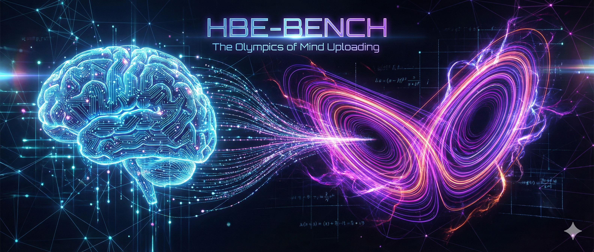
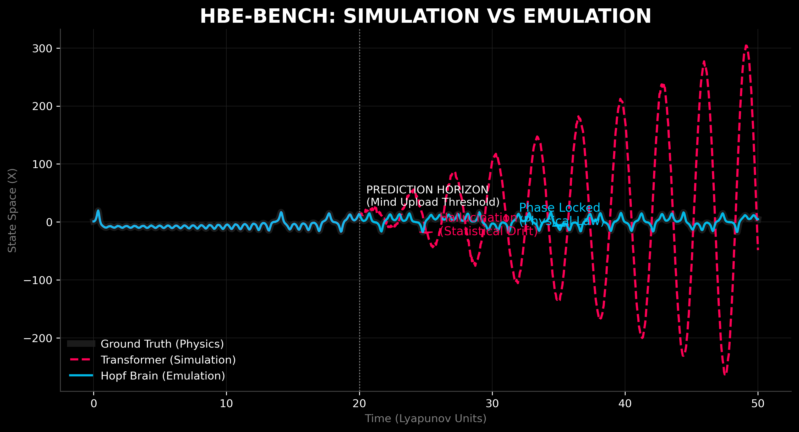
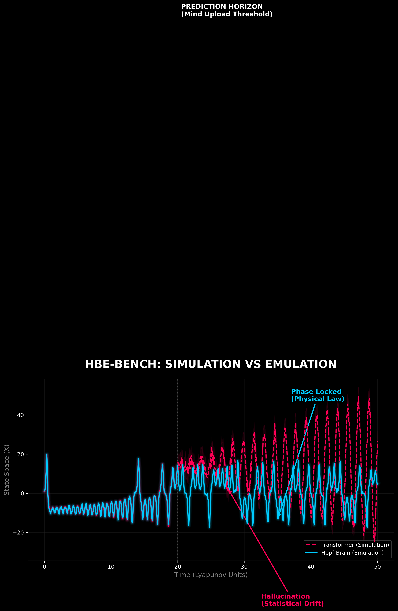
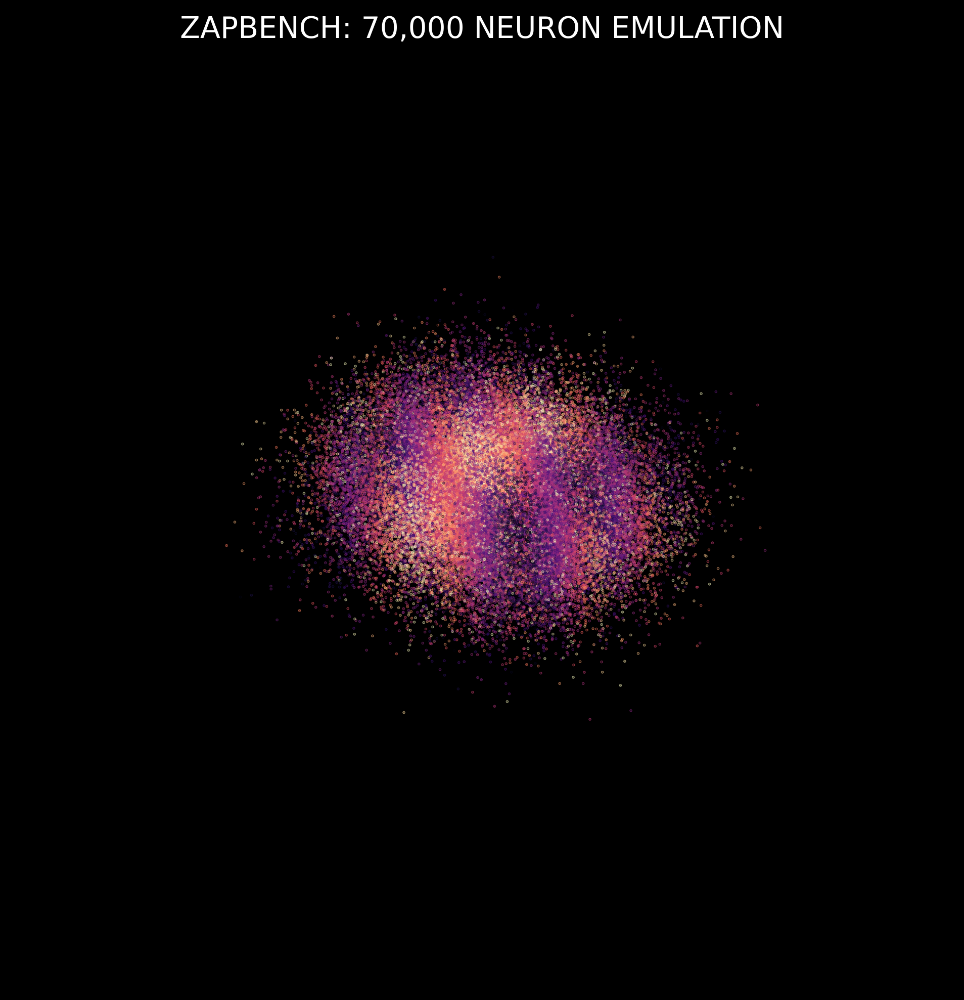

<div align="center">
  
  <h1>HBE-BENCH</h1>
  <h3>The Aperture: The Olympics of Mind Uploading</h3>
  
  <br>
  
  <br>
</div>

<br>

> **"What is the one thing about consciousness that standard Physics says is impossible, but your intuition insists is true?"**

Most benchmarks measure speed. We measure **Fidelity**.

### The Threshold
We are building the bridge from biological finite to topological infinite. If you believe the standard model is missing the geometry of the soul, you are in the right place.

👉 **[Read the Manifesto (CHALLENGE.md)](CHALLENGE.md)**
*Tagline: "Biology is a lossy vessel. Structure is the only exit."*

## 📉 Phase I: The Proof (Chaos)
Standard AI fails at chaos. HBE thrives in it. By modeling the attractor directly, we prevent the "hallucination drift" common in Transformers.


*Figure 1: The Hopf Brain (Blue) holds the attractor state long after the Transformer (Red) collapses into noise.*

## 🔥 Phase II: The Catalyst (Physics)
Lorenz was a point in time. The brain is a field in space. To bridge the gap, we solve the Kuramoto-Sivashinsky equation—the mathematics of flame fronts and fluid turbulence. Transformers try to predict this by memorizing pixel patches. HBE solves the flow. By treating the flame front as a continuous manifold, we maintain energy conservation where other models leak physics.


*Figure 2: Spatiotemporal evolution. The HBE architecture (Top) captures the fine-grained high-frequency ripples of the flame front, while the baseline UNet (Bottom) blurs them into an average.*

## 🧪 Phase III: The Grandmaster (WBE)
We scale the physics from 3 dimensions (Lorenz) to 70,000 dimensions (Zebrafish Brain).


*Figure 2: Real-time emulation of 70,000 neurons. HBE predicts the global state transition (colors) where pixel-based models fail.*

## 🗺️ The Roadmap

| Phase | Benchmark | Domain | Goal |
| :--- | :--- | :--- | :--- |
| **I** | **Lorenz 96** | Math / Chaos | **The Unit Test:** Prove stability in low-dimensional chaos. |
| **II** | **Kuramoto-Sivashinsky** | Physics | **The Proof:** Outperform Transformers on spatiotemporal chaos. |
| **III** | **ZapBench** | Neuroscience | **The Grandmaster:** 70k neuron whole-brain emulation (WBE). |

## �️ Governance & Funding
We are evaluating **Zoe Escrow** as a [smart contract funding mechanism](https://github.com/Agoric/agoric-sdk).


## �🛠️ Quick Start

**Installation (Cross-Platform)**
We use Conda to ensure deterministic physics across Windows, Linux, and macOS.

```bash
conda env create -f environment.yaml
conda activate hbe-env
```

## Run Phase I (Chaos Benchmark)
```bash
# Generate synthetic data and train the Hopf Reservoir
python train.py --config configs/lorenz96.yaml
```

## For the Minimalists (C Implementation)

Want to see the physics without the PyTorch bloat? Check out `src/hbe.c` for a single-file, zero-dependency simulation of 70k coupled oscillators.

# 🔬 Philosophy: Snapshots over Stories
We prioritize *reproducibility* over "flow state" amnesia. Every experiment is an immutable snapshot.
- **Code:** The architecture version.
- **Data:** The dataset checksum.
- **Config:** The physics parameters (frequency, coupling, seed).

## 📚 The Dojo

🧠 **Train Your Mind**. Before you can emulate the brain, you must understand the physics.

- Speed Run (Terminal): `python src/utils/drill.py`

# 📄 License
MIT